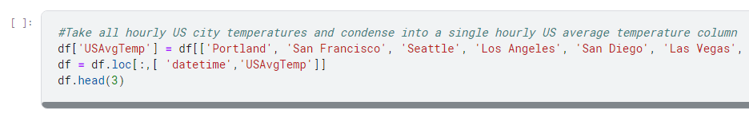
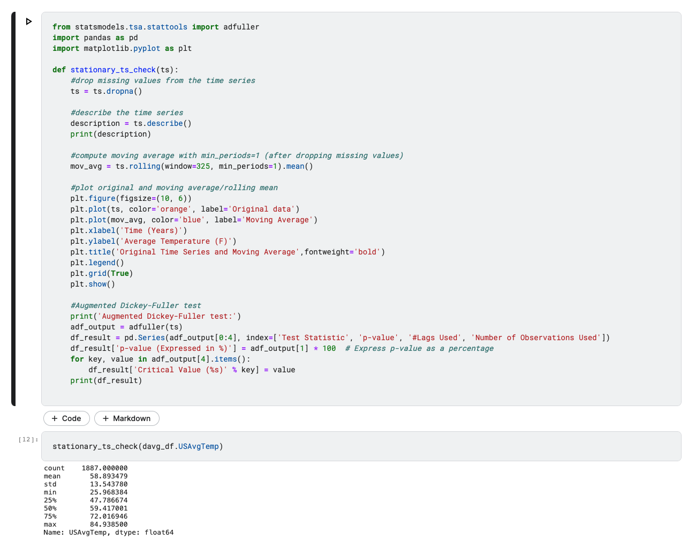
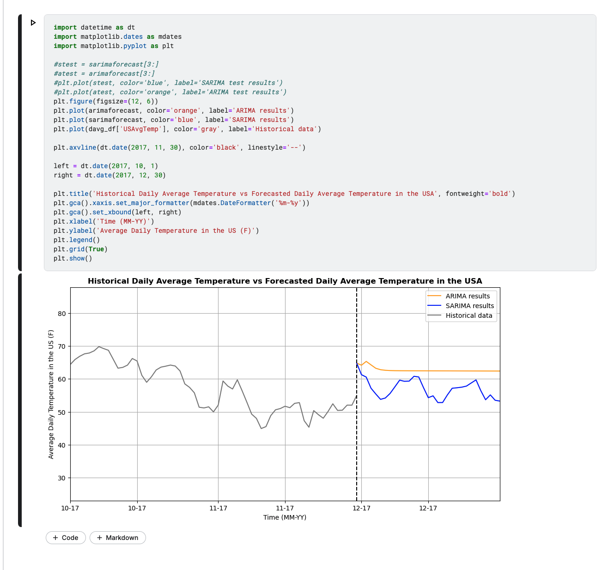

**Predicting Weather Changes using ARIMA and SARIMA Time Series Model**

**Table of Contents:**

I.  **Requirements**

II. **Dataset**

III. **Data Preprocess**

IV. **Data Cleaning**

V.  **Exploring and Visualization:**

VI. **Approach One: ARIMA Model**

VII. **Approach Two: SARIMA Model**

VIII. **Validation for both Models via Mean Squared Error (MSE)**

IX. **Final Results for both Models**

I.  **Requirements:**

> 	• Python 3.5 or higher
>
> 	• Numpy
>
> 	• Pandas
>
> 	• Matplotlib
>
> 	• Statsmodels
>
> 	• Adfuller
>
> 	• Itertools
>
> 	• Warnings
>
> 	• datetime
>
> 	• Pmdarima
>
> 	• Auto_arima
>
> **In order to enable Pmdarima and for the code to run correctly,
> internet must be enabled in your Kaggle notebook:**
>
> Select the arrow on the bottom right hand corner of the notebook.
>
> {width="6.359375546806649in"
> height="3.0038298337707787in"}
>
> Toggle internet settings to on.
>
> {width="2.2656255468066493in"
> height="4.245495406824147in"}
>
> If the option to enable internet access is not available, there will
> be a link in its place allowing the user to verify their account with
> a phone number. The option should then be available.
>
> **The data set will have to be added in order for the code to run.**
>
> Click on 'Add data' in the right hand pane.

{width="6.5in"
height="3.0833333333333335in"}

Click on the '+' button next to the 'Historic Hourly Weather Data'
dataset.

{width="6.5in"
height="3.0833333333333335in"}

You should now see the dataset added under 'Input'.

{width="6.5in"
height="3.0833333333333335in"}

II. **Dataset:**

[[https://www.kaggle.com/datasets/selfishgene/historical-hourly-weather-data?select=temperature.csv]{.underline}](https://www.kaggle.com/datasets/selfishgene/historical-hourly-weather-data?select=temperature.csv)

III. **Data Preprocess:**

Pre-processing began with excluding all non-US cities from the dataframe
and combining the rest into a single column for average hourly
temperature in the US by finding the mean. This was followed by
formatting the dates to remove the timestamp and then grouping all of
the hourly measurements into daily averages.

{width="6.5in"
height="1.0555555555555556in"}{width="6.5in"
height="0.7222222222222222in"}

IV. **Data Cleaning:**

In addition to having excluded non-US cities, the data cleaning involved
assigning points or ticks to better view the data without the context of
time and also converting the measurements from kelvin to Fahrenheit for
better interpretability.

{width="6.5in"
height="0.4444444444444444in"}{width="6.5in"
height="0.5833333333333334in"}

V.  **Exploring and Visualization:**

```{=html}
<!-- -->
```
1)  Plot to see all unique data points

> {width="4.35494094488189in"
> height="3.552347987751531in"}

2)  Perform Augmented Dickey-Fuller Test to determine if time series
    > data is stationary. Reject null hypothesis if p-value less than 5%

> {width="4.774277121609798in"
> height="3.7031255468066493in"}
>
> {width="6.5in"
> height="5.138888888888889in"}
>
> 2a) If data is not stationary, difference and perform another ADF test
> until p value is less than 5%
>
> {width="6.5in"
> height="5.916666666666667in"}

**VI. Approach One: ARIMA Model**

1)  Perform AIC Test to acquire optimal ARIMA order

> {width="4.550317147856518in"
> height="3.7919313210848644in"}

2)  Perform MSE on ARIMA Fitted Values against original differenced
    > dataset for validation

> {width="3.869792213473316in"
> height="3.2208202099737533in"}

3)  Show daily prediction for one month after dataset

> {width="4.241201881014873in"
> height="2.3177088801399823in"}

**VII. Approach Two: SARIMA Model**

1)  Plot differenced dataset and check for seasonality by performing
    > visual inspection on graph for seasonal pattern

> {width="4.824693788276465in"
> height="3.1004844706911636in"}

2)  Perform AIC Test to acquire optimal SARIMA order

> {width="4.796875546806649in"
> height="3.4362226596675414in"}

3)  Perform MSE on SARIMA Fitted Values against original differenced
    > dataset for validation

> {width="5.560898950131234in"
> height="4.843363954505687in"}

4)  Show daily prediction for one month after dataset

> {width="5.33569772528434in"
> height="3.0139774715660543in"}

**VIII. Validation for both Models via Mean Squared Error (MSE):**

{width="4.71875in"
height="3.2411089238845143in"}

{width="4.432292213473316in"
height="3.1466426071741034in"}

{width="4.636559492563429in"
height="3.336242344706912in"}

**IX. Final Results for both Models:**

1)  Perform inverse operation on differenced dataset to revert data back
    > to its original scale in Fahrenheit

> {width="6.5in"
> height="8.180555555555555in"}

2)  Plot Historical Data and Predictions

> {width="5.62432195975503in"
> height="4.984375546806649in"}
>
> {width="5.109375546806649in"
> height="4.785411198600175in"}


